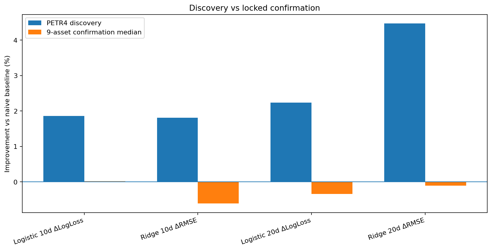
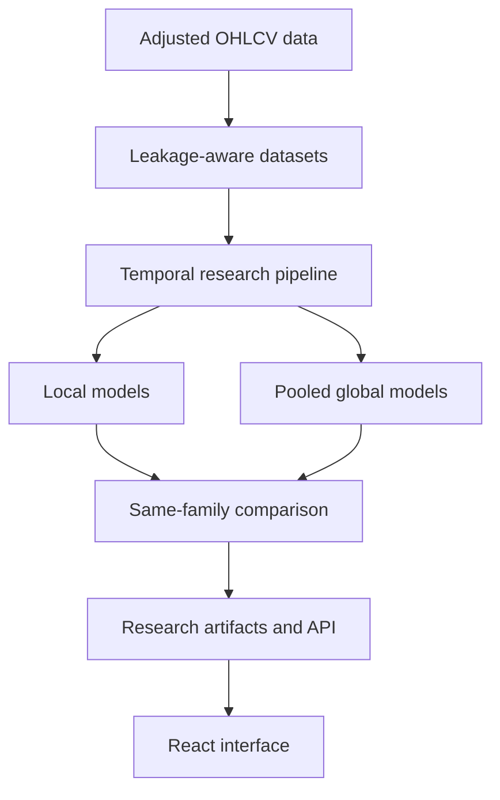

# Stock ML Lab

[](https://github.com/lslima123/stock-ml-lab/actions/workflows/ci.yml)
[](pyproject.toml)
[](https://fastapi.tiangolo.com/)
[](frontend/)
[](LICENSE)

**A research platform for evaluating financial time-series forecasting models
under realistic temporal validation.**

Stock ML Lab connects a leakage-aware research pipeline, classical and machine
learning models, dependence-aware statistical tests, pooled multi-asset models,
a typed FastAPI service and a React interface. Its goal is methodological
comparison—not automated trading or promises of financial return.

The project is intentionally evidence-driven: attractive exploratory results are
kept separate from locked confirmation, negative findings remain visible, and
model complexity is not treated as evidence of predictive value.

## At a glance

| Capability | Implementation |
| --- | --- |
| Tasks | Forward-return regression and direction classification |
| Horizons | 1, 5, 10 and 20 trading days |
| Scopes | Local, pooled Global and same-family Compare |
| Validation | Expanding windows, `gap=h`, target-maturity purge and nested temporal CV |
| Dependence | HAC inference, circular block bootstrap and non-overlapping phase checks |
| Robustness | Cross-asset studies, unseen-asset holdout, locked confirmation and BH FDR |
| Product layer | FastAPI, Pydantic, React, TypeScript and Vite |
| Quality | 105 automated tests, production front-end build and GitHub Actions CI |

## Research question

At the close of trading day $t$, the system uses only information available
through that close to forecast the return over the next $h$ trading days:

$$
r_t^{(h)} = \frac{P_{t+h}}{P_t} - 1,
\qquad h \in \{1,5,10,20\}.
$$

The corresponding classification target is

$$
y_t^{(h)} = \mathbf{1}\!\left(r_t^{(h)} > 0\right).
$$

For every test boundary, training is restricted to labels that have already
matured:

```text
target_end_date < test_start
```

This rule matters in a multi-asset panel: a row can be chronologically earlier
than the test window while its future-return label still overlaps that window.

## Main findings

The research history is useful precisely because it did **not** turn every
positive metric into a success claim.

| Stage | Finding | Status |
| --- | --- | --- |
| Daily regression | Complex models did not show a robust advantage over Zero Return | Negative result |
| Daily classification | Direct direction models did not reveal a hidden robust edge | Negative result |
| Multi-horizon discovery | PETR4 showed stronger 10d/20d ranking and regression metrics | Exploratory |
| Locked cross-asset confirmation | The PETR4 higher-horizon candidates did not generalize across nine other assets | Not confirmed |
| Local vs Global benchmark | Pooled models produced broad same-family OOS wins | Post hoc evidence after benchmark inspection |
| Independent scope confirmation | Global Ridge improved h=5 OOS RMSE on assets excluded from pooled training | **Confirmed** |

### Locked M14 result

M14 froze the horizon, feature set, model families, universes and inference rule
before evaluating ten assets disjoint from the original global training
universe.

| Task | Global improvement vs Local | HAC/FDR q | 95% block-bootstrap CI | Asset wins | Decision |
| --- | ---: | ---: | ---: | ---: | --- |
| Regression — Ridge | +1.7166% RMSE | 0.000132 | [+0.9096%, +2.5647%] | 9/10 | **Confirmed** |
| Classification — Logistic | +0.4098% Log Loss | 0.157742 | [-0.3876%, +1.2215%] | 7/10 | Not confirmed |

The confirmed quantity is a **relative reduction in forecasting loss**, not a
1.7 percentage-point investment return. The result does not establish trading
profitability and does not automatically extend to other horizons, algorithms
or feature sets.



## Methodological safeguards

| Risk | Control |
| --- | --- |
| Future information entering features | Features at $t$ use market data available no later than the close at $t$ |
| Immature labels crossing a split | `gap=h` for local series and explicit `target_end_date < test_start` for panels |
| Preprocessing leakage | Scalers and transformations are fitted inside training data only |
| Hyperparameter leakage | Optuna runs only in inner temporal folds; outer OOS blocks remain untouched |
| Overlapping h-day targets | HAC lags of at least `h-1`, date-block bootstrap and phase diagnostics |
| Multiple hypothesis testing | Benjamini–Hochberg false-discovery-rate control |
| Scope/algorithm confounding | Local vs Global comparisons keep the model family fixed |
| Discovery reuse | Confirmation uses frozen configurations and independent assets |
| Classical-model test refitting | State may update with realized observations; parameters are not re-estimated on test data |

The complete methodological contract is documented in
[docs/METHODOLOGY.md](docs/METHODOLOGY.md).

## Local, Global and Compare

| Scope | Training data | Purpose |
| --- | --- | --- |
| `local` | One requested ticker | Ticker-specific on-demand fit |
| `global` | Pooled core universe without ticker identity | Shared cross-series mapping loaded from a pretrained artifact |
| `compare` | Local and Global on the same request | Same-family side-by-side inference |

Supported controlled pairs:

- Regression: Local Ridge vs Global Ridge;
- Classification: Local Logistic vs Global Logistic.

This restriction isolates the effect of **training scope**. A comparison such as
Local XGBoost vs Global Ridge would mix scope and model-family effects.

## Architecture



Research code writes machine-readable artifacts. The reporting layer normalizes
those artifacts, the API exposes inference and evidence through typed contracts,
and the frontend consumes the API without duplicating scientific logic.

## Models and features

### Model families

- Baselines: Zero Return, Persistence and Prior Probability;
- Linear: Ridge Regression and Logistic Regression;
- Trees: Random Forest, XGBoost and CatBoost;
- Classical time series: ARIMA(1,0,1), AutoARIMA and VAR(5).

Classical models use rolling one-step-ahead forecasting. Parameters are fitted
once per fold; observed test values may update the forecasting state without
parameter refitting.

### Feature research

- `legacy`: 11 return, lag, trend, volatility, RSI and volume features;
- `extended`: momentum, drawdown, range and volume-standardization features;
- `market`: benchmark and relative-market features;
- `regime`: volatility ratios, rolling beta/correlation, trends and relative
  strength.

The production Local/Global comparison uses the shared 11-feature `legacy`
contract. Ticker identity is deliberately excluded from pooled models.

## Technology stack

| Layer | Tools |
| --- | --- |
| Data and research | Python, pandas, NumPy, yfinance |
| Modeling | scikit-learn, statsmodels, pmdarima, XGBoost, CatBoost |
| Optimization and inference | Optuna, HAC tests, block bootstrap, BH FDR |
| API | FastAPI, Pydantic, Uvicorn |
| Frontend | React 19, TypeScript, Vite |
| Delivery | pytest, Docker and GitHub Actions |

## Quick start

### 1. Install the Python project

```bash
git clone https://github.com/lslima123/stock-ml-lab.git
cd stock-ml-lab

python3 -m venv .venv
source .venv/bin/activate
pip install -e ".[dev]"
pytest -q
```

### 2. Start the API

```bash
uvicorn api:app --reload --host 127.0.0.1 --port 8000
```

Useful URLs:

- API documentation: <http://127.0.0.1:8000/docs>
- Health check: <http://127.0.0.1:8000/health>
- Capabilities: <http://127.0.0.1:8000/api/v1/capabilities>

Local inference and the bundled research endpoints work without pretrained
global binaries.

### 3. Start the React interface

In another terminal:

```bash
cd frontend
npm ci
npm run dev
```

Open <http://127.0.0.1:5173/app/>. Vite proxies API requests to the FastAPI
server running on port 8000.

For a production build served by FastAPI:

```bash
cd frontend
npm ci
npm run build
cd ..
uvicorn api:app --host 127.0.0.1 --port 8000
```

Then open <http://127.0.0.1:8000/app/>.

## Global artifacts

The eight M12 `.joblib` files are generated, cutoff-dependent binaries and are
therefore not committed. Build them with:

```bash
python3 global_train.py \
    --start 2018-01-01 \
    --end 2026-01-01 \
    --horizons 1 5 10 20 \
    --output-dir artifacts/global
```

After training, restart the API. Global and Compare become available when the
artifact set is complete. Inspect the status at:

```http
GET /api/v1/global/status
```

## API examples

### Local regression

```bash
curl -X POST http://127.0.0.1:8000/api/v1/predict \
  -H "Content-Type: application/json" \
  -d '{
    "ticker": "PETR4.SA",
    "task": "regression",
    "model": "ridge",
    "scope": "local",
    "horizon": 20
  }'
```

### Same-family scope comparison

```bash
curl -X POST http://127.0.0.1:8000/api/v1/predict \
  -H "Content-Type: application/json" \
  -d '{
    "ticker": "PETR4.SA",
    "task": "regression",
    "model": "ridge",
    "scope": "compare",
    "horizon": 20
  }'
```

### Research evidence

```http
GET /api/v1/research/summary
GET /api/v1/research/discovery
GET /api/v1/research/confirmation
GET /api/v1/research/scope-benchmark
GET /api/v1/research/scope-confirmation
```

For example:

```bash
curl "http://127.0.0.1:8000/api/v1/research/scope-confirmation?task=regression&horizon=5&level=summary"
```

## Reproducing the research

| Entry point | Purpose |
| --- | --- |
| `main.py` | Build and validate a supervised ticker dataset |
| `experiment.py` | Fixed-model temporal comparison |
| `tune.py` | Nested temporal hyperparameter optimization |
| `validate.py` | Statistical validation and economic backtesting |
| `cross_asset.py` | Core-universe robustness study |
| `classify.py` | Direct direction-classification study |
| `research.py` | Multi-horizon and feature-set research grid |
| `confirm.py` | M8.1 locked cross-asset confirmation |
| `visualize.py` | Static analytics report generation |
| `global_train.py` | Pooled-model training and validation |
| `compare.py` | M13 Local vs Global benchmark |
| `analyze_compare.py` | Explicitly post hoc M13 diagnostics |
| `scope_confirm.py` | M14 locked independent scope confirmation |

Example fixed-model experiment:

```bash
python3 experiment.py PETR4.SA \
    --start 2018-01-01 \
    --end 2026-01-01 \
    --test-size 252
```

The first valid M14 run is the canonical confirmation and must not be rerun for
model selection. Its frozen contract is stored in
[`configs/m14_locked_scope.json`](configs/m14_locked_scope.json), and its complete
curated output is stored under [`examples/m14_snapshot/`](examples/m14_snapshot/).

## Repository layout

```text
stock-ml-lab/
├── src/stock_ml_lab/       # datasets, models, validation, reporting and API
├── tests/                  # automated scientific and application contracts
├── frontend/               # React + TypeScript interface
├── configs/                # frozen experiment protocols
├── examples/               # curated, source-controlled research evidence
├── artifacts/global/       # generated pooled-model binaries (ignored by Git)
├── reports/                # generated experiment runs (ignored by Git)
├── docs/                   # methodology and complete research history
├── Dockerfile
└── pyproject.toml
```

## Curated evidence

- [`examples/api_analytics/`](examples/api_analytics/) — normalized tables,
  figures and the static research report;
- [`examples/m13_snapshot/`](examples/m13_snapshot/) — complete benchmark tables
  and compressed OOS predictions;
- [`examples/m14_snapshot/`](examples/m14_snapshot/) — canonical independent
  confirmation, training audit and compressed predictions;
- [`configs/m14_locked_scope.json`](configs/m14_locked_scope.json) — frozen M14
  protocol.

Generated outputs remain outside version control so that exploratory runs cannot
silently replace the curated evidence.

## Project evolution

| Milestones | Delivery |
| --- | --- |
| M1–M3 | Leakage-tested dataset engine, temporal evaluation and classical/ML models |
| M4–M5 | Nested Optuna tuning, statistical tests and cost-aware economic validation |
| M6–M8.1 | Cross-asset robustness, classification, horizons/features and locked confirmation |
| M9–M11 | Static reporting, typed FastAPI service and React interface |
| M12–M14 | Pooled global models, same-family scope benchmark and independent confirmation |
| M15 | Publication-ready, tested and documented release |

The complete milestone-by-milestone record is preserved in
[docs/RESEARCH_HISTORY.md](docs/RESEARCH_HISTORY.md). See also
[CHANGELOG.md](CHANGELOG.md).

## Limitations

- Market data are sourced through yfinance and inherit provider/data-quality
  limitations.
- Multi-day targets overlap; dependence-aware inference reduces but does not
  make consecutive targets independent.
- The confirmed M14 result concerns Ridge, the legacy feature set and h=5 only.
- Global models intentionally omit ticker identity and currently use a fixed
  ten-asset training universe.
- Statistical improvement in forecasting loss is not evidence of economic
  profitability.
- This project does not execute trades or provide investment recommendations.

## License

Released under the [MIT License](LICENSE).
